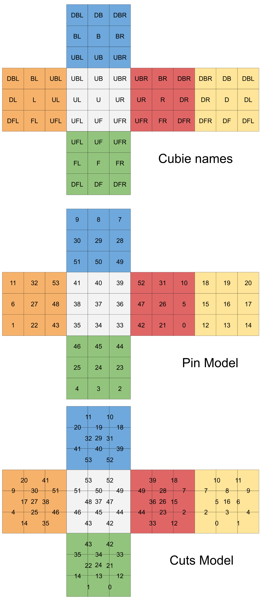

# bandaged-cube-explorer
Bandaged Cube Explorer is a js tool for exploring the configurations of a
bandaged 3x3x3 Rubik's cube.

## Bandaging

Bandaging is a way of modifying a twisty puzzle to create a new challenge. Here
is a nice video about it that also sets up the idea of a graph of bandaged
states: https://www.youtube.com/watch?v=7ke6momBndU

## Prior Art

When I started this project, I quickly ran into
https://github.com/paulnasca/paul_cube_bandaged_graph/ . I'm especially thankful
to Paul for the csv he collected.

## Understanding the bandaged signatures

When I started this project I wanted it to be compatible with the existing
naming scheme for bandaged cubes that was used by others - but I had a hard time
finding documentation for it. The big idea is that there are
56 bonds that could be present which would bind together two adjacent cubies. We
can store those 56 bits of information in a bit-set and then use bitwise
operations to quickly check or set the state of the cube. But which bits go with
which bonds?

The bottom two images contain the same information but from different
perspectives. I found both useful while writing this program. 

The second one shows what I call the "pin model". In this model, we imagine
shoving a pin through a sticker until it binds one cube to the one below it.
This is useful for checking if a face can be turned. A face is turnable when
none of the stickers on it have a pin in them.

The lowest image is what I call the "cuts model". In this model, we think of
every split between pieces on the cube as being able to be invalidated by a bond. When a
bond is present, the corresponding line segments go away. This model was handy
for drawing legends showing what a bandaged signature should look like.
